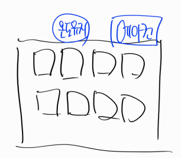

# 통신의 역사

### 1. 통신은 세계대전을 통해 유럽에서 발전했다.
### 2. 통신을 하기 위한 문자 단위는 당연히 영어 문자이다.
### 3. 영어 문자는 8bit 로 표현 가능하다. 256가지의 경우의 수를 포함하며 모든 대문자, 숫자, 특수문자를 표현할 수 있는 범위이다.
### 4. 8bit 단위로 전송되는 2진수 데이터는 아스키코드를 통해 변환 가능하다.
### 5. 통신은 bit단위로 전송된다. 하지만 인간은 8bit 단위로 끊어 읽어야 한다. 인간은 모든 것을 추상화 한다.
### 6. 통신으로 전달되는 데이터는 물리적으로는 광케이블로 전송되지만, 논리적으로는 Byte Stream을 통해 전송된다.
### 7. 통신으로 전달되는 데이터는 어딘가에 저장되어야 CPU로 처리가 가능해진다. 그것은 메모리이며 메모리 공간의 최소 단위는 8bit 이다. 왜 일까?
### 8. 8bit 단위로 전송되는 영문자는, 한글, 중국어, 고대 고어, 일본어를 표현하지 못한다.
### 9. 모든 문자를 표현하는 문자 인코딩 방식이 필요하다 UTF-8(완성형과 조합형)

---

간단한 비트먼저 보면 도체와 부도체가 있습니다. 도체는 전류가 흐르고 부도체는 전류가 흐르지 않습니다. 따라서 전류를 도체에 흘리면 항상 흐르고 부도체에 흐르면 안 흐릅니다. 이런 것들로는 경우의 수를 제어를 못 하죠. 어떤 경우의 수를 제어하려면 트리거가 필요합니다. 따라서 그 트리거가 반도체 입니다. 반도체는 특징이 있는데 그것은 열로 전류를 제어합니다. 즉 on /off 가 가능합니다.  열로써 가능하게 되죠.

예를 들어 컴퓨터가 많은 전산실로 가면 무조건 에어컨이 있습니다. 특정 온도를 유지하기 위해서 반드시 에어컨이 필요합니다. 왜냐하면 열이 많이 발생하면 전류가 흐르지 않습니다. 그래서 컴퓨터에도 쿨러가 필요한 이유가 이러한 이유 때문입니다. 이것은 반도체의 특징입니다. 즉 열을 다운시켜야 전류가 흐르는 것입니다. 이것을 열로 제어하는 것입니다. 전류를 흐르게 할지 아니면 흐르지 않게 할지것인지를 말입니다. 이게 반도체 입니다. 그럼 이 반도체 하나가지고 할 수 있는게 하나가 있습니다.

전류가 흐르면 1이라고 표현을 합니다. 왜냐하면 인간은 추상화를 하기 때문입니다. 전류가 흐르지 않으면 0이라고 표현합니다. 따라서 이 반도체 하나는 0 과1을 표현할 수 있기 때문에 bit 라고 부릅니다. bit는 컴퓨터에서 가장 작은 단위입니다. 이 비트 하나는 경우를 2가지를 표현합니다. 0이면 off 이고 1이면 on입니다.

이런것은 단순한 형광등을 표현할 수 있습니다. 스위치를 통해서 on/off만 가능합니다. 하지만 다양한 제어는 할 수 없습니다. 선풍기를 예를 들어 볼까요?  선풍기는 강풍 미풍 약풍 종료가 있습니다. 이런 경우는 최소 2bit가 필요 합니다. 반도체가 2개가 있으며 00 01 10 11 이렇게 만들어지고, 각각의 버튼에 Mapping을 시키면 됩니다. 즉 경우의 수를 늘리면 매우 많은 일들을 할 수 있는 것이며, 경우의 수를 매우 많이 늘려서 제약이 없게 할 수도 있는 것입니다. 하지만 경우의 수를 끝까지 늘리게 되면 용량을 매우 많이 차지를 하겠죠?

일단 이것을 설명하기 위해서 A와 B가 있고 둘이서 통신을 할 것이라고 생각합시다. 아까 전 처럼 11이라는 데이터를 보내 강풍이라고 알 수 있으면 프로그래밍에서는 뭐라고 할까요? 네 바로 프로토콜이라고 합니다. 서로 약속이 되어 있는 겁니다. 나도 표가 있고 상대방도 표를 가지고 있는 겁니다. 서로 표를 들고 있는 상태에서 A가 11을 광케이블을 통해서 전달하면 B가 11을 받았을 때 어떤 처리를 해야할지는 프로토콜이 없이 아무것도 못합니다. 즉 서로 프로토콜을 공유해야 통신을 할 수 있고, 프로토콜을 공유하지 못하면 공유하지 못한다는 의미입니다. 통신에서 가장 중요한 것은 프로토콜입니다 그렇다면 B도 같은 프로토콜을 가지고 있어야합니다.

아까전에 본 프로토콜 기억하시나요? 네 바로 아스키 코드가 프로토콜입니다. 내가 어떤 데이터를 보낼 때 상대방이 데이터를 원복해서 숫자화 시켜서 무엇인지 보는 프로토콜 표가 있는 것입니다. 아스키 코드표를 보고 분석을 하는 것 입니다. 그럼 이 아스키코드의 엄청난 장점이 있습니다.

A와 B가 통신을 할 것입니다. 서로 어떤 행동을 할 프로토콜을 정해서, A가 B 한테 부탁을 할려고합니다. 하지만 프로토콜을 정해놓으면 부탁에는 한계가 있습니다. 예를 들어 2bit로 약속을 정하면 4가지의 부탁만 가능하게 됩니다. 이걸 늘려 8bit가 되면 256가지의 부탁이 가능하고 2의 32승이면 42억9천개의 부탁(통신)을 할 수 있습니다. 
생각을 해봅시다. 
우리가 만약 A와 B가 전화 통화를 한다고 생각해봅시다. 서로 통신 할 수 있는 경우의 수는 무한합니다. 여러 경우의 수 즉 자연어를 처리하려면 경우의 수는 한정되어 있으면 안됩니다. 우리가 A와 B가 한정이 되어 있으면, 한정되어 있는 부분 밖에 통신이 되지 않습니다. 하지만 우리는 매우 자연스러운 채팅을 하고 싶은 것입니다. 이 채팅을 하고 싶으면 경우의 수를 한정 지을수 없습니다. 그래서 통신을 할 때 우리는 경우의 수를 정하지 않고 문자 단위로 통신을 하는 것입니다. 즉 보낼 때 a이렇게 8bit 단위로 끊어서 보냅니다. p p l e 이렇게 아무런 약속 없이 아스키코드표 하나만으로 하나씩 끊어서 대화를 할 수 있습니다. 8비트 단위의 프로토콜 하나만 있으면 더 이상의 프로토콜은 필요가 없게 됩니다. 왜냐하면 통신이란 사람이 이해하는 것이기 때문입니다.

사람이 이해하는 통신은 8비트 하나만 있으면 모든 것이 가능합니다. 기계가 이해하는 것인 이게 불가능 합니다. 기계는 하나하나 모두 정해줘야 하지만, 사람이 이해하는 통신은 8비트 단위로 문자를 연속적으로 끊어서 보내면 모든 것을 다 이해할 수 있습니다. 그래서 통신을 (추상적으로) Byte Stream이라고 합니다. 이것은 매우매우 중요합니다. 반드시 이해를 해야합니다. 그래서 우리는 앞으로 Byte stream을 통해서 통신을 할 것 입니다. A가 B에게 8비트를 보낸다고 합니다. 우리는 1바이트(문자 하나, a)를 보낸다고 합니다. 그러면 B는 a를 저장해야 합니다. 컴퓨터는 이 것을 저장해야 합니다.

일단 컴퓨터는 CPU와 RAM으로 구성되어 있고, 이 두가지만 있으면 동작을 합니다. 이 메모리에는 데이터를 저장할 수 있는 서랍(주소번지)이 있습니다. 우리는 1바이트로 받았기 때문에 해당 데이터는 각각의 서랍 최소크기인 8비트에 각각 나누어서 들어가게 됩니다. 바이트로 전달되어서 오는 데이터는 8비트 되기 때문입니다. 그러면 다음에 들어오는 데이터가 차곡차곡 쌓이게 되겠죠. 8비트 단위로 데이터가 메모리에 적재 됩니다. 
혹시 8비트 컴퓨터 32비트 컴퓨터 들어보셨나요? 이것은 메모리에서 한 번에 몇비트를 들고 올 수 있냐를 뜻하는 의미 입니다. 즉 여기에 있는 n비트를 메모리에서 한번에 들고와서 처리할 수 있으면 n비트 컴퓨터라고 하는 것입니다. CPU가 처리할 수 있는 최소단위가 있는 것입니다. 만약 16비트 컴퓨터가 있으면 메모리에 있는 2개의 서랍을 가져와서 처리를 하겠죠? 2개의 데이터를 가져와서 임시로 어딘가에 저장을 해야 합니다. CPU밑에 저장을 하게 되는데 그 장소를 레지스터라고 합니다. 레지스터라는 말을 기억해주세요. CPU는 레지스터에 있는 데이터를 처리합니다. 
만약 나의 컴퓨터가 64비트 컴퓨터이라고 생각해봅시다. 32비트 프로그램을 다운로드를 받으면  이 프로그램은 32비트씩 데이터를 전달하는 프로그램인 것입니다.  그러면 CPU가 일을 할 수있을까요? 네 할 수 있습니다. 하지만 64 - 32 = 32 비트씩 낭비를 계속 하겠죠. 반대로 이야기 하면 컴퓨터가 32비트 이고 64비트 프로그램을 다운하면 처리가 불가능 하다는 의미가 됩니다. 왜냐하면 이 경우에는 한번에 처리할 수 있는 양이 32비트이기 때문입니다.
모든 통신은 Byte 단위로 통신을 하는 것 입니다. 이 선을 Byte Stream 이라고 합니다. Stream을 개울 이라고 합니다. Byte는 문자하나를 의미합니다. 즉 문자하나를 보내서(통신해서) 메모리에 저장을 하는 것입니다. 16비트이면 8 + 8해서 2개 ab를 CPU 레지스터에 저장을 하는 것이겠죠. 여기서 캐시라는 개념을 알아야 합니다.

레지스터도 저장공간이고 RAM도 저장공간입니다. 하지만 비용은 레지스터가 훨씬 비싸고 16MB(160만 바이트, 쉽게 설명하면 160만개의 영문을 저장할 수 있는 공간)입니다. RAM은 16GB(160억 바이트, 160억개를 저장할 수 있는 공간)입니다. 그리고 일단 CPU입장에서 데이터 1개 ab가 필요하다고 합시다. CPU는 RAM에게 가서 ab를 가져올 필요가 없습니다. 왜냐하면 이미 ab를 레지스터가 가지고 있기 때문이죠. 하지만 만약 CPU가 c라는 데이터를 필요로 하면 없기 때문에 RAM에서 c데이터를 레지스터로 가져와서 처리를 해야겠죠.
그러면 여기서 이러한 개념이 나오게 됩니다. 캐시에 대해서 상대적인 개념을 이해해야 합니다.
CPU와 레지스터(CPU가 들고 있는 저장공간)가 있고 RAM과 RAM이 들고 있는 저장 공간이 있습니다. RAM은 전류로 흐르기 때문에 컴퓨터가 꺼지면 데이터가 다 날아갑니다. 내부가 트랜지스터로 구성되어 있기 때문입니다. 즉 RAM은 전류로 만들어져 있는 것입니다. 전류가 흐르면서 데이터가 저장이 되는 것이기 때문에 전원의 파워가 없으면 데이터가 전부 날아갑니다. 
그래서 데이터를 영구히 기록하기 위해서 HDD(하드디스크)를 사용합니다(요즘에는 SSD를 사용하고 있습니다.) 더 나아가 RAM에서 HDD로 기록하는 것을 커밋(commit)이라고 합니다. 이 커밋은 영구히 기록한다는 것입니다. 개념상 RAM에 저장한다고 해서 커밋이 되는 것이 아닙니다. HDD에 저장해야 영구히 기록이 됩니다.(전류를 끊어도 데이터가 저장되어 있습니다.) 반대로 HDD에서 RAM으로 데이터를 가져오는 것을 로드(road) 라고합니다. (게임에서 보면 로딩이라고 하는 것과 같습니다.) CPU는 데이터가 필요하면 RAM에게 요청을 합니다.
a라는 데이터를 요청했다고 가정을 하고, RAM은 b c만 가지고 있다고 합시다. 그리고 레지스터도 c만 가지고 있다고 합시다. 또한 HDD에는 모든 데이터가 있다고 합시다. CPU가 RAM에게 a가 필요하다고 하면 RAM은 들고 있지 않으니까 HDD에게 로딩 요청을 합니다. 로딩 요청을 통해 a를 RAM으로 가져옵니다. 그 후  a를 레지스터로 가져옵니다. 
만약 CPU입장에서 b를 요청하면 RAM이 b를 가지고 있으니까 HDD에게 b를 요청하지 않습니다. 바로 b를 가져옵니다. 이런 경우에는 CPU입장에서는 b를 캐시메모리로 봅니다. 왜냐하면 HDD에 비해 상대적으로 가까이 있기 때문이죠. 
즉 캐시 한다는 것이 이런 것 입니다. 내가 원하는 데이터가 어디보다 가까워야한다 라는 것이 캐시라는 것입니다. 그러면 CPU입장에서 c라는 데이터가 필요합니다. 하지만 이미 레지스터에 존재하죠? 그러면 RAM에게 요청을 하지 않고 바로 처리합니다. 이런 경우에도 c를 캐시메모리라고 부르는 것입니다.
즉, 캐시는 호출하는 위치에서 상대적인 위치에 따라 불리게 되는 것 입니다.

정리하면 통신은 유럽에서 발전해서, 데이터의 전송 단위가 한글이 아니고 영어(문자하나)로 되어있습니다. 문자 하나를 전송하는 선을 우리는 Byte Stream이라고 부르고, 바이트스트림을 통해서 데이터를 전송하게 됩니다. 근데 실제로 날아가는 데이터는 (이진수)bit가 8번 날라가는 것입니다.
그러면 A라는 영역에서 B라는 영역으로 데이터를 전송할 때, 내가 날리는 데이터가 a라고 하면 해당 데이터는 Byte Stream을 통해서 전송이 되고,  받는 쪽에서는 그걸 RAM으로 받고 그걸 CPU가 받아서 처리합니다. 바이트단위로 전송하는 것을 기본 룰로 하고 있는 것입니다.
마지막으로 정리하면 지금 통신은 아스키코드로 하지 않지만 아예는 아닙니다. 우리가 전세계적으로 통신을 하고있기 때문입니다.

지금은 전세계적으로 통신을 하고 있습니다. 우리가 홈페이지를 만들어도 전 세계사람들이 사용할 수 있도록 만들어야 합니다. 우리나라만 사용하는 것이 아니고 전세계 사람들이 사용하기 때문이죠. 예전에는 아스키코드는 영문자만 가능했습니다. 하지만 한글을 보내고 싶으면 가장 많이 사용했던 것이 EUC-KR문자 셋 이어서, 예전에 정말 많이 사용했습니다. 이 문자셋 아스키코드, EUC-KR 특징은 모두 완성형 문자 셋이라고 합니다.

완성형 문자셋이라고 하는 것은 표를 하나 들고 있는 것입니다. 0 1 2 3 4 … 번호를 표에 Mapping하는 것이죠. 해당 표 번호에다가 가 갸 거 겨 고 교 이런식으로 넣으면 한글은 8비트로 처리가 안됩니다. 따라서 한글은 완성형 표에서는 최소 2바이트가 필요합니다. 2바이트는 경우의 수로 나타내면 65536개가 됩니다. 

따라서 이렇게 표현되는 완성형의 단점은 예전에 채팅에서 ‘뵑’ 같은 문자가 깨지게 되었습니다. 왜냐하면 완성형 표에 뵑 같은 단어는 예전에 존재하지 않아 해석이 안되었기 때문입니다. 지금은 가장 많이 사용하는 문자 셋 집합은 UTF - 8이라는 조합형 문자셋을 가장 많이 사용합니다.
이것(UTF - 8)은 특이하게 1~4바이트 가변 문자 셋입니다. 이것은 조합형이라고 합니다. 완성형 이랑은 다릅니다. 예를들어 a이라는 데이터를 전송하면서 a는 ‘이 데이터는 utf - 8이야’라고 알려주면, 프로토콜이 필요하다고 했죠? 왜냐하면 프로토콜없이는 데이터 전송을 못합니다. 

내가 지금 보내는 데이터는 ‘utf -8이야’ 하면, 내가 a를 보내면 1바이트 보내지고 내가 ‘가’를 보내면 3바이트씩 끊어 읽습니다. 

쉽게 이야기하면 A B가 서로 통신을 하는데 a를 보내면 8비트로 끊어서 읽고(그래야지 읽을 수 있기 때문이죠) 한글을 보내면 24비트(8비트 x 3)로 끊어서 읽습니다. 이게 프로토콜입니다. 24비트로 한글을 읽지 않으면 문자들이 전부 깨지게 됩니다. 이게 utf - 8입니다. 즉 전세계화 때문에 그렇습니다.

그리고 여기서의 조합형의 의미는 완성형처럼 표가 있는 것이 아니라, 한글에는 초성 중성 종성 나누어서 ㄱ ㅏ ㄱ 이렇게 끊어서 각각 1바이트씩 보내는 것입니다. 이렇게 보내는 것을 조합형이라고 합니다. 앞으로의 통신할때는 utf-8로 한다고 외웁시다. 매우 중요합니다. 전세계의 모든 문자셋은 utf-8이기 때문입니다.
